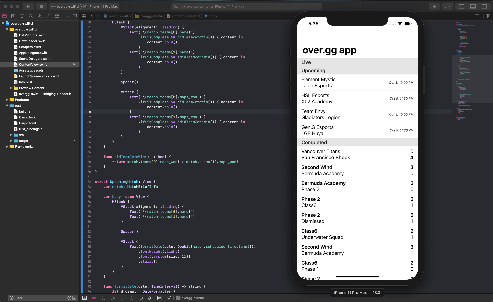

# overgg-swiftui

A SwiftUI-based iOS app that calls into a Rust-provided C API that wraps a Rust scraper for the [over.gg](https://over.gg) site.

## What is this?

A while back I wrote [overgg-scraper](https://github.com/cldfire/overgg-scraper), a Rust crate that scrapes data from [over.gg](https://over.gg) (an Overwatch esports site). I'd been working on an iOS app in Swift that scraped the site and had a Today view widget to display information about completed Overwatch matches. I decided to spice things up a little bit by instead implementing the scraper functionality in Rust and calling into it from Swift, and although the app never got finished (I realized I wouldn't be able to use the app on my phone without either paying Apple $100 a year or re-signing the binary every week), I had a lot of fun working on it.

Fast forward to today: I discovered SwiftUI and it looks really neat, so I decided to play around with it by cleaning up this old project.

## Building

You will need to have [cargo-lipo](https://github.com/TimNN/cargo-lipo) installed and the Rust iOS targets set up (see cargo-lipo's readme for info).

Thanks to cargo-lipo's super-neat XCode integration, all you have to do is clone the repository, open the XCode project, and then kick off a build from the UI.
